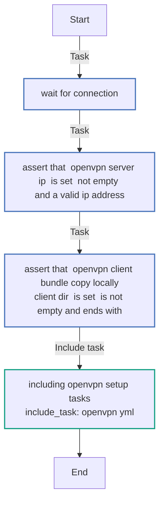

<!-- DOCSIBLE START -->

# 📃 Role overview

## ansible-role-openvpn

Description: An Ansible Role that installs and configures an OpenVPN server,
automatically generating all necessary client configuration files
for secure connections.

### Defaults

**These are static variables with lower priority**

#### File: defaults/main.yml

| Var          | Type         | Value       |Required    | Title       |
|--------------|--------------|-------------|-------------|-------------|
| [openvpn_server_ip](defaults/main.yml#L4)   | str   | `{{ ansible_host }}` |    True  |  Public IP of your OpenVPN instance |
| [openvpn_pkgs](defaults/main.yml#L8)   | list   | `['openvpn', 'git']` |    True  |  Required packages |
| [openvpn_subnet_cidr](defaults/main.yml#L14)   | str   | `10.8.0.0` |    True  |  OpenVPN Subnet |
| [openvpn_subnet_netmask](defaults/main.yml#L18)   | str   | `255.255.255.0` |    True  |  OpenVPN Netmask |
| [openvpn_nat_rules_subnets](defaults/main.yml#L22)   | list   | `['10.8.0.0/24']` |    True  |  OpenVPN Subnet (used to configure iptables NAT rules) |
| [easy_rsa_git_repo_tag](defaults/main.yml#L27)   | str   | `v3.2.1` |    True  |  EasyRSA Git Repository tag |
| [openvpn_client_bundle_copy_locally](defaults/main.yml#L31)   | dict   | `{'local_copy': True, 'client_dir': '/tmp/openvpn/'}` |    True  |  Local directory (on your machine) where the resulting OpenVPN client configuration files will be copied. |

### Tasks

#### File: tasks/main.yml

| Name | Module | Has Conditions |
| ---- | ------ | --------- |
| Wait for connection... | ansible.builtin.wait_for_connection | False |
| Assert that "openvpn_server_ip" is set, not empty, and a valid IP address | ansible.builtin.assert | False |
| Assert that "openvpn_client_bundle_copy_locally.client_dir" is set, is not empty and ends with "/" | ansible.builtin.assert | False |
| Including Openvpn setup tasks | ansible.builtin.include_tasks | False |

#### File: tasks/openvpn.yml

| Name | Module | Has Conditions |
| ---- | ------ | --------- |
| Check if SELinux is installed | ansible.builtin.find | False |
| Configuring SELinux in permissive mode | ansible.posix.selinux | True |
| Ensure Firewalld/Iptables service are stopped | ansible.builtin.service | False |
| Install OpenVPN packages | ansible.builtin.package | False |
| Clone Easy-RSA repo | ansible.builtin.git | False |
| Load "iptable_nat" module | ansible.builtin.shell | False |
| Enable IPV4 IP forwarding | ansible.posix.sysctl | False |
| Get the first non-loopback network interface | ansible.builtin.set_fact | False |
| Render OpenVPN NAT rules template | ansible.builtin.template | False |
| Copy OpenVPN NAT rules systemd unit | ansible.builtin.copy | False |
| Start & Enable OpenVPN NAT rules systemd service | ansible.builtin.systemd_service | False |
| Retrieve dir containing the binary based on easy-rsa major version | ansible.builtin.set_fact | False |
| Make sure easyrsa binary exist ("{{ easyrsa_binary_dir }}/easyrsa") | ansible.builtin.stat | False |
| Fail if file "{{ easyrsa_binary_dir }}/easyrsa" does not exist | ansible.builtin.fail | True |
| Check if the Easy-RSA PKI dir was already initialized ("{{ easyrsa_binary_dir }}/pki") | ansible.builtin.stat | False |
| Easy-RSA PKI dir was already initialized | ansible.builtin.debug | True |
| Generate "easyrsa" files | block | True |
| Initialize the PKI, build the CA, generate the Diffie-Hellman key, create/sign server & client certificates | ansible.builtin.shell | False |
| Generate a TLS key for OpenVPN | ansible.builtin.shell | False |
| Copy OpenVPN systemd unit file | ansible.builtin.copy | False |
| Copy OpenVPN "server.conf" template | ansible.builtin.template | False |
| Start & Enable openvpn systemd service | ansible.builtin.systemd_service | False |
| Create the client-bundle directory | ansible.builtin.file | False |
| Copy OpenVPN "client.conf" template | ansible.builtin.template | False |
| Copy client files to the "/etc/openvpn/client-bundle" directory | ansible.builtin.copy | False |
| Copy OpenVPN Client Bundle locally | block | True |
| Find files in the directory "/etc/openvpn/client-bundle" | ansible.builtin.find | False |
| Copy OpenVPN Client Bundle locally on "{{ openvpn_client_bundle_copy_locally.client_dir }}" | ansible.builtin.fetch | False |

## Task Flow Graphs

### Graph for main.yml

### Graph for openvpn.yml

```mermaid
flowchart TD
Start
classDef block stroke:#3498db,stroke-width:2px;
classDef task stroke:#4b76bb,stroke-width:2px;
classDef includeTasks stroke:#16a085,stroke-width:2px;
classDef importTasks stroke:#34495e,stroke-width:2px;
classDef includeRole stroke:#2980b9,stroke-width:2px;
classDef importRole stroke:#699ba7,stroke-width:2px;
classDef includeVars stroke:#8e44ad,stroke-width:2px;
classDef rescue stroke:#665352,stroke-width:2px;

  Start-->|Task| Check_if_SELinux_is_installed0[check if selinux is installed]:::task
  Check_if_SELinux_is_installed0-->|Task| Configuring_SELinux_in_permissive_mode1[configuring selinux in permissive mode<br>When: **selinux result files   length   0**]:::task
  Configuring_SELinux_in_permissive_mode1-->|Task| Ensure_Firewalld_Iptables_service_are_stopped2[ensure firewalld iptables service are stopped]:::task
  Ensure_Firewalld_Iptables_service_are_stopped2-->|Task| Install_OpenVPN_packages3[install openvpn packages]:::task
  Install_OpenVPN_packages3-->|Task| Clone_Easy_RSA_repo4[clone easy rsa repo]:::task
  Clone_Easy_RSA_repo4-->|Task| Load__iptable_nat__module5[load  iptable nat  module]:::task
  Load__iptable_nat__module5-->|Task| Enable_IPV4_IP_forwarding6[enable ipv4 ip forwarding]:::task
  Enable_IPV4_IP_forwarding6-->|Task| Get_the_first_non_loopback_network_interface7[get the first non loopback network interface]:::task
  Get_the_first_non_loopback_network_interface7-->|Task| Render_OpenVPN_NAT_rules_template8[render openvpn nat rules template]:::task
  Render_OpenVPN_NAT_rules_template8-->|Task| Copy_OpenVPN_NAT_rules_systemd_unit9[copy openvpn nat rules systemd unit]:::task
  Copy_OpenVPN_NAT_rules_systemd_unit9-->|Task| Start___Enable_OpenVPN_NAT_rules_systemd_service10[start   enable openvpn nat rules systemd service]:::task
  Start___Enable_OpenVPN_NAT_rules_systemd_service10-->|Task| Retrieve_dir_containing_the_binary_based_on_easy_rsa_major_version11[retrieve dir containing the binary based on easy<br>rsa major version]:::task
  Retrieve_dir_containing_the_binary_based_on_easy_rsa_major_version11-->|Task| Make_sure_easyrsa_binary_exist___easyrsa_binary_dir_easyrsa__12[make sure easyrsa binary exist   easyrsa binary<br>dir easyrsa  ]:::task
  Make_sure_easyrsa_binary_exist___easyrsa_binary_dir_easyrsa__12-->|Task| Fail_if_file__easyrsa_binary_dir_easyrsa__does_not_exist13[fail if file  easyrsa binary dir easyrsa  does not<br>exist<br>When: **not stat easyrsa binary stat exists**]:::task
  Fail_if_file__easyrsa_binary_dir_easyrsa__does_not_exist13-->|Task| Check_if_the_Easy_RSA_PKI_dir_was_already_initialized___easyrsa_binary_dir_pki__14[check if the easy rsa pki dir was already<br>initialized   easyrsa binary dir pki  ]:::task
  Check_if_the_Easy_RSA_PKI_dir_was_already_initialized___easyrsa_binary_dir_pki__14-->|Task| Easy_RSA_PKI_dir_was_already_initialized15[easy rsa pki dir was already initialized<br>When: **stat easyrsa pki stat exists**]:::task
  Easy_RSA_PKI_dir_was_already_initialized15-->|Block Start| Generate__easyrsa__files16_block_start_0[[generate  easyrsa  files<br>When: **not stat easyrsa pki stat exists**]]:::block
  Generate__easyrsa__files16_block_start_0-->|Task| Initialize_the_PKI__build_the_CA__generate_the_Diffie_Hellman_key__create_sign_server___client_certificates0[initialize the pki  build the ca  generate the<br>diffie hellman key  create sign server   client<br>certificates]:::task
  Initialize_the_PKI__build_the_CA__generate_the_Diffie_Hellman_key__create_sign_server___client_certificates0-->|Task| Generate_a_TLS_key_for_OpenVPN1[generate a tls key for openvpn]:::task
  Generate_a_TLS_key_for_OpenVPN1-.->|End of Block| Generate__easyrsa__files16_block_start_0
  Generate_a_TLS_key_for_OpenVPN1-->|Task| Copy_OpenVPN_systemd_unit_file17[copy openvpn systemd unit file]:::task
  Copy_OpenVPN_systemd_unit_file17-->|Task| Copy_OpenVPN__server_conf__template18[copy openvpn  server conf  template]:::task
  Copy_OpenVPN__server_conf__template18-->|Task| Start___Enable_openvpn_systemd_service19[start   enable openvpn systemd service]:::task
  Start___Enable_openvpn_systemd_service19-->|Task| Create_the_client_bundle_directory20[create the client bundle directory]:::task
  Create_the_client_bundle_directory20-->|Task| Copy_OpenVPN__client_conf__template21[copy openvpn  client conf  template]:::task
  Copy_OpenVPN__client_conf__template21-->|Task| Copy_client_files_to_the___etc_openvpn_client_bundle__directory22[copy client files to the   etc openvpn client<br>bundle  directory]:::task
  Copy_client_files_to_the___etc_openvpn_client_bundle__directory22-->|Block Start| Copy_OpenVPN_Client_Bundle_locally23_block_start_0[[copy openvpn client bundle locally<br>When: **openvpn client bundle copy locally local copy and<br>openvpn client bundle copy locally client dir  <br>length   0 and openvpn client bundle copy locally<br>client dir endswith**]]:::block
  Copy_OpenVPN_Client_Bundle_locally23_block_start_0-->|Task| Find_files_in_the_directory___etc_openvpn_client_bundle_0[find files in the directory   etc openvpn client<br>bundle ]:::task
  Find_files_in_the_directory___etc_openvpn_client_bundle_0-->|Task| Copy_OpenVPN_Client_Bundle_locally_on_____openvpn_client_bundle_copy_locally_client_dir____1[copy openvpn client bundle locally on     openvpn<br>client bundle copy locally client dir    ]:::task
  Copy_OpenVPN_Client_Bundle_locally_on_____openvpn_client_bundle_copy_locally_client_dir____1-.->|End of Block| Copy_OpenVPN_Client_Bundle_locally23_block_start_0
  Copy_OpenVPN_Client_Bundle_locally_on_____openvpn_client_bundle_copy_locally_client_dir____1-->End
```

## Author Information
https://www.linkedin.com/in/lucaesposito87/

#### License

MIT

#### Minimum Ansible Version

2.7

#### Platforms

- **Amazon Linux**: ['2']

#### Dependencies

No dependencies specified.
<!-- DOCSIBLE END -->
